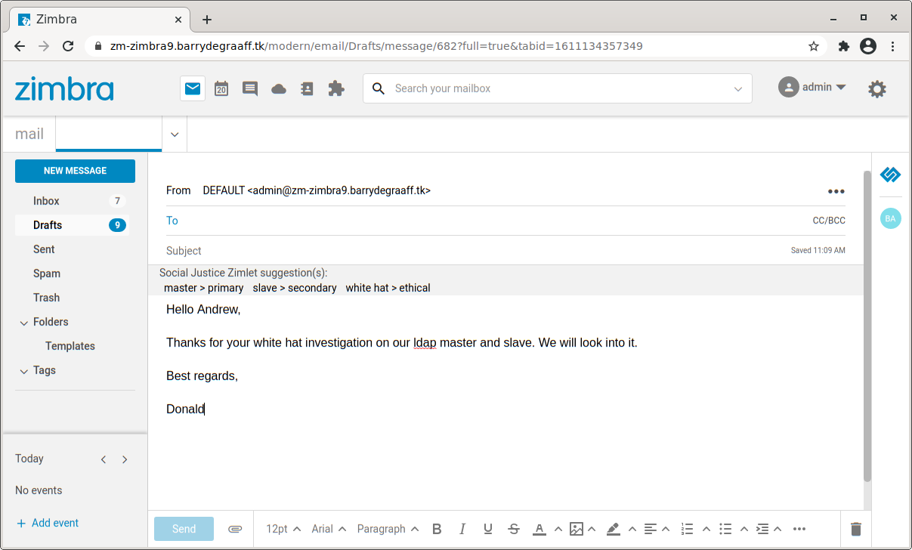

# Social Justice Zimlet

The Social Justice Zimlet searches for words while you type an email and suggests alternative words. Example: master ldap > primary ldap. This guide will show you how to write a Zimlet that uses a keyup event, so you can write Zimlets that interact with the Zimbra composer while the user types. It also introduces how you can use the `selection` object to do advanced tricks.


## Screenshots

> 
*The Social Justice Zimlet.*

## Advanced use of composer

The Zimbra composer is based on TinyMCE. You can use the browsers native `selection` object and compine it with TinyMCE's comprehensive API to do advanced tasks. 

This code snippet shows how to add an onkeyup event handler and get the last typed word:

```javascript
export default class MoreMenu extends Component {
    constructor(props) {
        super(props);
        this.zimletContext = props.children.context;

        this.props.getComposer().on('keyup', function (e) {
                var selRng = this.props.getComposer().selection.getRng();
                this.props.getComposer().selection.setRng(selRng);
        
                let content = this.props.getComposer().selection;
                let contentText = content.getSel().focusNode.data;
                try {
                    let contentTillCaret = contentText.substring(0, selRng.startOffset);
                    let lastTypedWord = this.lastWord(contentTillCaret);
                    //do something here
                } catch (err) { console.log(err) };
        }.bind(this));
    }
```

This code snippet shows how to replace the last typed word:

```javascript
    
    replaceWord = (myNewWord) => {  
        this.props.getComposer().selection.getSel().modify('extend', 'backward', 'word');
        this.props.getComposer().selection.setContent(myNewWord);
    }

```

The Social Justice Zimlet is an example of using keyup.
